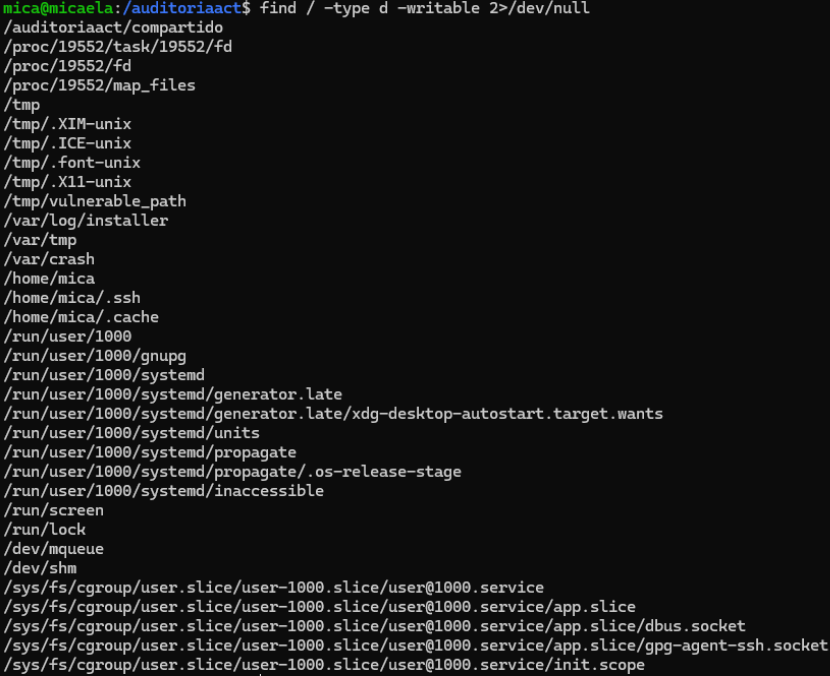

```text
██╗     ██╗███╗   ██╗██╗   ██╗██╗  ██╗
██║     ██║████╗  ██║██║   ██║╚██╗██╔╝
██║     ██║██╔██╗ ██║██║   ██║ ╚███╔╝ 
██║     ██║██║╚██╗██║██║   ██║ ██╔██╗ 
███████╗██║██║ ╚████║╚██████╔╝██╔╝ ██╗
╚══════╝╚═╝╚═╝  ╚═══╝ ╚═════╝ ╚═╝  ╚═╝

Linux Security Audit · Hardening · Blue Team
```

# Linux Security Audit and Hardening Lab


Laboratorio orientado a auditoría de seguridad y bastionado Linux mediante análisis de permisos inseguros, configuraciones vulnerables, riesgos de escalada de privilegios y aplicación de medidas defensivas básicas.

---

> [!NOTE]
> Todas las pruebas y configuraciones realizadas durante este laboratorio se ejecutaron en un entorno virtualizado y controlado con fines educativos y de aprendizaje.

---

# Descripción del proyecto

Este laboratorio se centra en el análisis de seguridad de un sistema Linux desde una perspectiva defensiva, identificando configuraciones inseguras relacionadas con permisos, directorios vulnerables, variables del sistema, archivos SUID y opciones de montaje.

El objetivo principal fue comprender cómo pequeñas configuraciones incorrectas pueden convertirse en vectores de ataque reales dentro de un entorno Linux, especialmente en escenarios relacionados con escalada de privilegios, ejecución de binarios maliciosos o abuso de permisos inseguros.

Durante el laboratorio se realizaron diferentes auditorías utilizando herramientas y comandos nativos de Linux para detectar directorios world writable, configuraciones peligrosas en la variable PATH, binarios SUID potencialmente peligrosos y particiones montadas con permisos inseguros.

Además del análisis de riesgos, también se aplicaron medidas de mitigación y hardening orientadas a reforzar la seguridad general del sistema siguiendo principios básicos de Blue Team y administración segura.

---

# Objetivos del laboratorio

- Auditar permisos inseguros en Linux
- Detectar directorios world writable
- Identificar riesgos relacionados con SUID
- Analizar configuraciones inseguras de PATH
- Revisar opciones de montaje de particiones
- Aplicar medidas básicas de hardening
- Comprender riesgos de escalada de privilegios
- Reforzar conocimientos de Linux y seguridad defensiva

---

# Tecnologías y herramientas utilizadas

| Herramienta | Función |
|---|---|
| Ubuntu Server | Sistema analizado |
| Linux CLI | Auditoría y administración |
| Lynis | Auditoría de seguridad |
| ACL | Gestión de permisos avanzados |
| net-tools | Comprobación de red |
| secure-delete | Borrado seguro |
| lsof | Análisis de archivos abiertos |
| tree | Visualización de estructuras |
| VirtualBox | Virtualización |

---
# Análisis realizados

Durante la auditoría se revisaron diferentes configuraciones relacionadas con seguridad del sistema:

- Directorios con permisos inseguros
- Directorios world writable
- Binarios SUID
- Variable PATH vulnerable
- Configuración de particiones
- Permisos de ejecución
- Carpetas compartidas inseguras
- Borrado seguro de archivos

---

# Riesgos detectados

Entre los principales problemas identificados durante el laboratorio se encontraron:

| Riesgo | Impacto |
|---|---|
| Directorios 777 | Escritura y ejecución no autorizada |
| PATH Hijacking | Ejecución de binarios maliciosos |
| SUID inseguro | Escalada de privilegios |
| Particiones mal montadas | Ejecución de código no controlado |
| Permisos excesivos | Acceso indebido a recursos |

---

# Medidas de hardening aplicadas

Durante el laboratorio se aplicaron diferentes medidas defensivas orientadas a reducir la superficie de ataque del sistema:

- Restricción de permisos
- Aplicación del principio de mínimo privilegio
- Eliminación de SUID innecesarios
- Endurecimiento de particiones
- Revisión de directorios compartidos
- Uso de opciones noexec, nosuid y nodev
- Borrado seguro de información sensible

---

# Capturas del laboratorio

## Auditoría de permisos inseguros


---

## Directorios world writable



---

## Variable PATH vulnerable


---

## Configuración de particiones


---

## Borrado seguro con shred


---

# Resultados obtenidos

El laboratorio permitió identificar múltiples configuraciones inseguras dentro del sistema Linux que podrían facilitar ataques relacionados con escalada de privilegios, ejecución de código no autorizado o abuso de permisos inseguros.

Además, ayudó a comprender cómo pequeños errores de configuración pueden convertirse en riesgos importantes dentro de un entorno real si no se aplican medidas básicas de hardening.

La parte relacionada con PATH Hijacking, permisos 777 y binarios SUID permitió entender especialmente cómo ciertos vectores pueden ser aprovechados por un atacante para obtener acceso o ejecutar acciones no autorizadas dentro del sistema.

---

# Skills 

- Linux Security
- System Hardening
- Privilege Escalation Analysis
- Linux Permissions
- PATH Hijacking
- SUID Analysis
- Defensive Security
- Blue Team Fundamentals
- Linux Administration
- Security Auditing


---

# Documentación completa

La documentación técnica detallada se encuentra en:

[Ver documentación completa](docs/full-documentation.md)

---

> [!TIP]
> Muchas vulnerabilidades en Linux no provienen de malware avanzado, sino de configuraciones inseguras, permisos incorrectos y errores básicos de administración del sistema.

---

# Autor

Proyecto desarrollado como laboratorio práctico orientado a auditoría de seguridad Linux, análisis de configuraciones inseguras y aplicación de medidas básicas de hardening defensivo.
