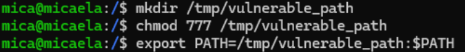
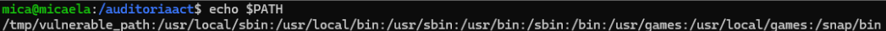
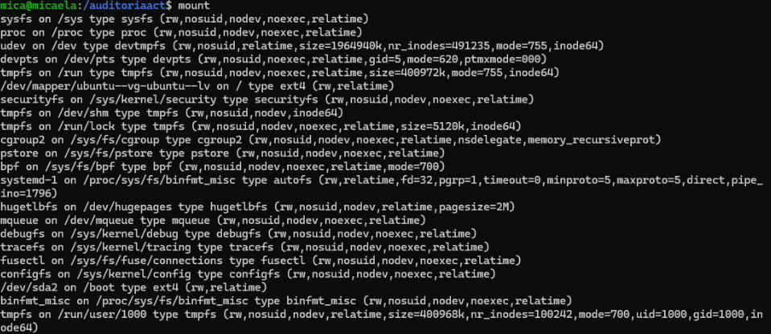
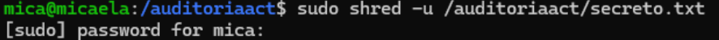

# Documentación completa - Auditoría de seguridad y hardening en Linux

# Introducción

Este laboratorio se desarrolló con el objetivo de analizar diferentes configuraciones inseguras dentro de sistemas Linux y comprender cómo pequeños errores de administración pueden convertirse en riesgos reales relacionados con escalada de privilegios, ejecución de código no autorizado o abuso de permisos excesivos.

A diferencia de otros proyectos más centrados en herramientas concretas, este laboratorio estuvo orientado principalmente a comprender cómo funciona la seguridad interna del sistema operativo Linux desde una perspectiva defensiva. Gran parte del trabajo consistió en revisar permisos, analizar binarios especiales, comprobar configuraciones inseguras y aplicar medidas básicas de hardening orientadas a reducir superficie de ataque.

El entorno se desplegó sobre máquinas virtuales utilizando VirtualBox, permitiendo realizar todas las pruebas dentro de un laboratorio controlado y aislado. La máquina principal utilizada fue Ubuntu Server, mientras que Kali Linux se utilizó como sistema auxiliar para validación y comprobaciones relacionadas con seguridad.

Además de la parte técnica, el laboratorio ayudó especialmente a reforzar conocimientos relacionados con administración Linux, control de accesos, permisos, monitorización y principios básicos de Blue Team orientados a securización de sistemas.

---

> [!NOTE]
> Todas las pruebas y configuraciones realizadas durante el laboratorio se ejecutaron únicamente sobre sistemas virtualizados y controlados con fines educativos y de aprendizaje.

---

# Objetivos del laboratorio

Los principales objetivos del proyecto fueron los siguientes:

- Auditar permisos inseguros dentro de Linux
- Detectar directorios world writable
- Analizar riesgos relacionados con PATH Hijacking
- Revisar binarios SUID
- Comprobar configuraciones inseguras de particiones
- Aplicar medidas básicas de hardening
- Comprender riesgos relacionados con escalada de privilegios
- Reforzar conocimientos de administración Linux y seguridad defensiva

---

# Arquitectura del laboratorio

El entorno utilizado durante el laboratorio estuvo formado por varias máquinas virtuales conectadas mediante una red interna.

| Máquina | Función |
|---|---|
| Ubuntu Server | Sistema auditado |
| Kali Linux | Validación y pruebas |

La máquina Ubuntu actuó como sistema principal sobre el que se realizaron auditorías, revisiones de permisos y pruebas relacionadas con hardening, mientras que Kali Linux permitió validar determinados escenarios y realizar comprobaciones adicionales.

---

# 1. Preparación del entorno

## 1.1 Configuración inicial

Antes de comenzar con la auditoría se preparó el entorno virtualizado creando las máquinas necesarias dentro de VirtualBox. Ambas máquinas se configuraron utilizando una red interna para mantener el laboratorio completamente aislado.

El objetivo principal fue disponer de un entorno seguro donde poder realizar análisis de permisos, pruebas relacionadas con escalada de privilegios y modificaciones del sistema sin afectar sistemas externos reales.

También se configuraron direcciones IP estáticas para facilitar la conectividad y mantener una infraestructura estable durante todas las pruebas.

---

## 1.2 Actualización del sistema

Antes de instalar herramientas o modificar configuraciones se actualizó completamente el sistema operativo.

```bash
sudo apt update
sudo apt upgrade -y
```

Este paso permitió asegurar que los paquetes instalados estuviesen actualizados y evitar posibles problemas relacionados con dependencias antiguas o configuraciones incompatibles.

Aunque pueda parecer algo básico, mantener el sistema actualizado es una de las medidas más importantes dentro de cualquier estrategia de hardening.

---

## 1.3 Instalación de herramientas auxiliares

Durante el laboratorio se instalaron diferentes herramientas relacionadas con auditoría y administración Linux.

```bash
sudo apt install tree lsof acl secure-delete net-tools -y
```

También se trabajó con herramientas como:

- Lynis
- shred
- chmod
- chown
- find
- mount

El objetivo fue utilizar herramientas nativas y sencillas para comprender cómo pueden realizarse auditorías defensivas básicas sin necesidad de software extremadamente complejo.

---

# 2. Auditoría de permisos inseguros

## 2.1 Importancia de los permisos en Linux

La gestión de permisos es una de las bases fundamentales de seguridad dentro de Linux.

Los permisos controlan qué usuarios pueden:

- leer archivos
- modificarlos
- ejecutarlos
- acceder a directorios
- interactuar con recursos del sistema

Una configuración incorrecta puede provocar accesos no autorizados, modificación de información sensible o incluso escenarios de escalada de privilegios.

---

## 2.2 Análisis de permisos excesivos

Durante el laboratorio se revisaron archivos y directorios configurados con permisos excesivamente permisivos.

Especialmente se analizaron permisos como:

```bash
777
```

Este tipo de configuración concede lectura, escritura y ejecución a cualquier usuario del sistema.

Aunque puede utilizarse temporalmente durante determinadas pruebas, en entornos reales representa un riesgo importante porque facilita:

- modificación de archivos
- ejecución de contenido malicioso
- alteración de scripts
- persistencia
- abuso de privilegios

---

## 2.3 Búsqueda de directorios world writable

Para localizar directorios inseguros se utilizaron comandos como:

```bash
find / -type d -perm -0002 2>/dev/null
```

Este análisis permitió identificar rutas donde cualquier usuario podía escribir contenido dentro del sistema.

Los directorios world writable pueden convertirse en un riesgo especialmente grave si además contienen scripts ejecutables o forman parte de rutas utilizadas por servicios privilegiados.



---

## 2.4 Corrección de permisos

Una vez identificados los problemas, se aplicaron medidas correctivas utilizando:

```bash
chmod
```

y:

```bash
chown
```

El objetivo principal fue restringir accesos y aplicar el principio de mínimo privilegio sobre archivos y directorios sensibles.

---

# 3. Análisis de PATH Hijacking

## 3.1 Funcionamiento de PATH

Durante el laboratorio se analizó la variable PATH del sistema para detectar configuraciones inseguras.

La variable PATH indica al sistema en qué rutas debe buscar ejecutables cuando un usuario lanza comandos desde terminal o scripts.

Su contenido puede visualizarse mediante:

```bash
echo $PATH
```

---

## 3.2 Riesgos relacionados con PATH Hijacking

El principal riesgo aparece cuando la variable PATH contiene directorios inseguros o modificables por usuarios sin privilegios.

En este tipo de escenarios un atacante podría introducir un binario malicioso con el mismo nombre que un comando legítimo y conseguir ejecución arbitraria.

Especialmente peligrosos resultan los scripts privilegiados que llaman comandos sin utilizar rutas absolutas.

---

## 3.3 Mitigaciones aplicadas

Durante el laboratorio se revisaron rutas inseguras y se aplicaron medidas como:

- restricción de permisos
- eliminación de directorios inseguros
- uso de rutas absolutas
- revisión de variables de entorno



---

> [!IMPORTANT]
> Muchos escenarios de escalada de privilegios dentro de Linux no requieren vulnerabilidades complejas, sino simplemente configuraciones inseguras relacionadas con permisos o variables de entorno.

---

# 4. Análisis de binarios SUID

## 4.1 Funcionamiento de SUID

Los archivos configurados con permisos SUID se ejecutan con privilegios del propietario del archivo y no del usuario que los lanza.

Esto significa que determinados programas pueden ejecutarse con permisos elevados incluso cuando son utilizados por usuarios normales.

Aunque algunos binarios necesitan este comportamiento para funcionar correctamente, también representan un vector clásico relacionado con escalada de privilegios.

---

## 4.2 Auditoría de binarios SUID

Para localizar archivos SUID dentro del sistema se utilizó:

```bash
find / -perm -4000 2>/dev/null
```

Posteriormente se revisaron especialmente:

- binarios poco habituales
- permisos innecesarios
- scripts inseguros
- herramientas potencialmente peligrosas

---

## 4.3 Riesgos detectados

Los riesgos asociados a SUID incluyen:

- ejecución privilegiada
- abuso de binarios vulnerables
- ejecución de shells
- bypass de restricciones
- escalada de privilegios

Por ello, una parte importante del laboratorio consistió en identificar qué binarios realmente necesitaban estos permisos y cuáles podían eliminarse.

---

# 5. Seguridad en particiones y montaje

## 5.1 Revisión de sistemas montados

Otra parte importante del laboratorio estuvo relacionada con configuraciones de particiones y opciones de montaje.

Para revisar sistemas montados se utilizó:

```bash
mount
```

También se revisó:

```bash
/etc/fstab
```

---

## 5.2 Opciones de seguridad

Se analizaron especialmente opciones como:

- noexec
- nosuid
- nodev

Estas opciones permiten limitar:

- ejecución de binarios
- abuso de permisos SUID
- uso indebido de dispositivos

Son especialmente importantes en directorios temporales o compartidos.

---

## 5.3 Mitigaciones aplicadas

Durante el laboratorio se aplicaron configuraciones más seguras sobre determinadas particiones con el objetivo de reducir superficie de ataque y limitar posibilidades de abuso.



---

# 6. Borrado seguro de información

## 6.1 Importancia del borrado seguro

Durante el laboratorio también se trabajó el borrado seguro de información utilizando herramientas orientadas a dificultar recuperación forense.

En Linux, eliminar un archivo normalmente no destruye realmente su contenido físico, sino únicamente las referencias utilizadas por el sistema de archivos.

Esto significa que, dependiendo del sistema y herramientas disponibles, parte de la información podría recuperarse posteriormente.

---

## 6.2 Uso de shred

La principal herramienta utilizada fue:

```bash
shred -u archivo.txt
```

El objetivo de este comando es sobrescribir varias veces el contenido antes de eliminar el archivo definitivamente.

Esto ayuda a dificultar recuperación posterior de información sensible.

---

## 6.3 Aplicaciones prácticas

El borrado seguro resulta especialmente importante para:

- credenciales
- documentos sensibles
- logs
- archivos temporales
- backups antiguos



---

# 7. Auditoría automática con Lynis

## 7.1 Uso de Lynis

También se realizaron auditorías utilizando Lynis:

```bash
sudo lynis audit system
```

Esta herramienta permitió detectar:

- configuraciones inseguras
- permisos incorrectos
- servicios innecesarios
- recomendaciones de hardening


---

# 8. Resultados obtenidos

El laboratorio permitió identificar diferentes configuraciones inseguras relacionadas con:

- permisos excesivos
- SUID
- PATH Hijacking
- particiones mal configuradas
- directorios inseguros

Además, ayudó a comprender cómo pequeños errores de administración pueden convertirse en riesgos importantes dentro de sistemas Linux si no se aplican medidas básicas de hardening.

---

# 9. Conclusiones

Este laboratorio permitió trabajar de forma práctica conceptos fundamentales relacionados con seguridad defensiva y hardening dentro de Linux.

Además de aprender comandos y configuraciones concretas, la parte más importante fue comprender cómo determinadas malas prácticas pueden facilitar escenarios reales de escalada de privilegios y cómo aplicar medidas orientadas a reducir superficie de ataque y mejorar la seguridad general del sistema.

El proyecto también ayudó a reforzar conocimientos relacionados con:

- administración Linux
- permisos
- control de accesos
- hardening
- auditoría defensiva
- Blue Team
- análisis de riesgos
- monitorización básica
